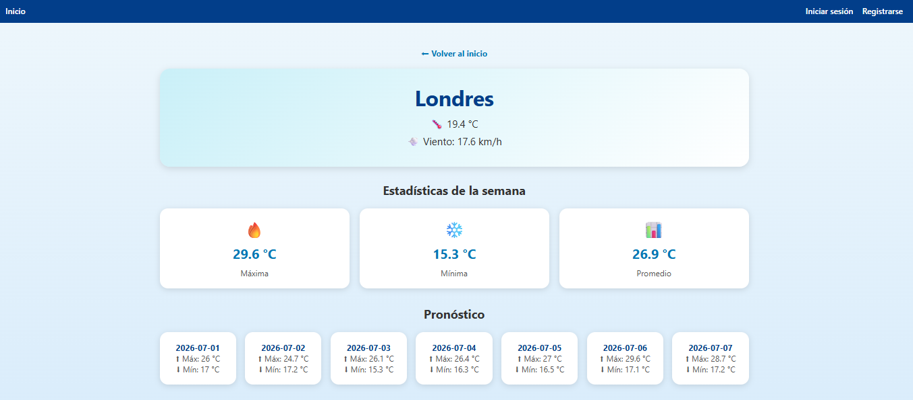

# 🌐 Portafolio Personal - Luisa María Hoyos



## 📖 Descripción

Este proyecto corresponde a mi portafolio personal desarrollado con **Vue.js** como parte del módulo de Desarrollo Front-End.

El objetivo del portafolio es presentar mi perfil profesional, las tecnologías que manejo y algunos de los proyectos realizados durante mi proceso de formación.

---

## 🚀 Tecnologías utilizadas

- HTML5
- CSS3
- JavaScript (ES6)
- Vue.js 3
- Vite
- Git
- GitHub
- Devicon

---

## 📂 Secciones del portafolio

- Inicio
- Sobre mí
- Tecnologías
- Proyectos
- Contacto

---

## 💻 Proyectos destacados

### 🌤️ App de Clima Vue

Aplicación desarrollada con Vue.js que permite consultar información climática utilizando una API REST.

### 🌦️ App de Clima JavaScript

Proyecto desarrollado con HTML, CSS y JavaScript para practicar manipulación del DOM, estructuras de datos y renderizado dinámico.

### 🔗 Consumo de API REST

Proyecto enfocado en el consumo de servicios web utilizando Fetch API, Promesas y manejo de datos JSON.

---

## ▶️ Instalación

Clonar el repositorio:

```bash
git clone https://github.com/TU-USUARIO/TU-REPOSITORIO.git
```

Entrar al proyecto:

```bash
cd portafolio-luisa
```

Instalar dependencias:

```bash
npm install
```

Ejecutar el proyecto:

```bash
npm run dev
```

---

## 📸 Vista previa

El portafolio incluye:

- Hero de presentación
- Sección "Sobre mí"
- Tecnologías utilizadas
- Proyectos destacados
- Información de contacto
- Diseño responsive

---

## 📁 Estructura del proyecto

```
src
│
├── assets
├── components
├── data
├── views
├── App.vue
└── main.js
```

---

## 👩‍💻 Autor

**Luisa María Hoyos**

Desarrolladora Front-End en formación.

GitHub:
https://github.com/luisahoyos757-cmd

---

## 📄 Licencia

Proyecto desarrollado con fines académicos como parte del proceso de formación en Desarrollo Front-End.